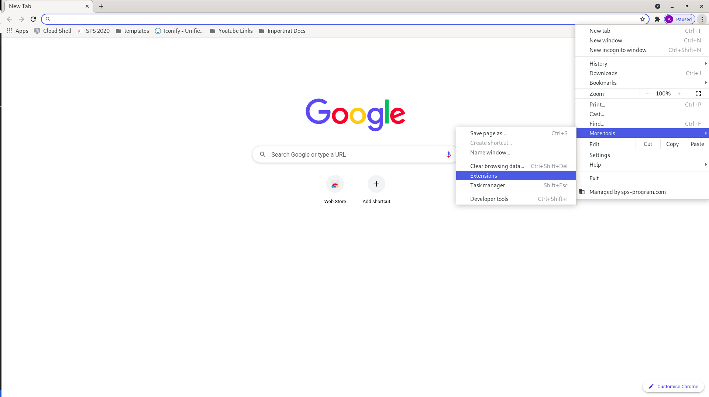
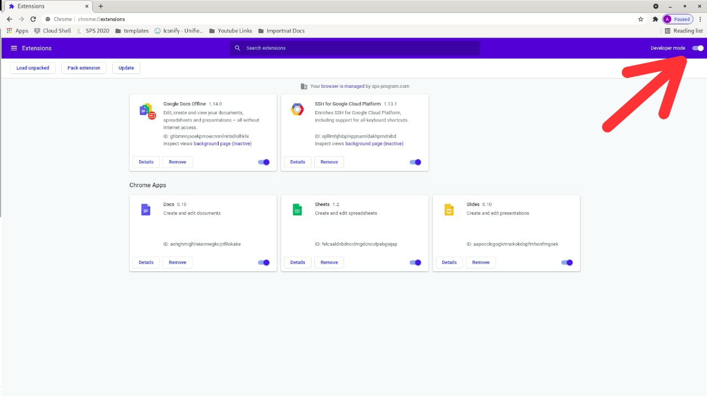
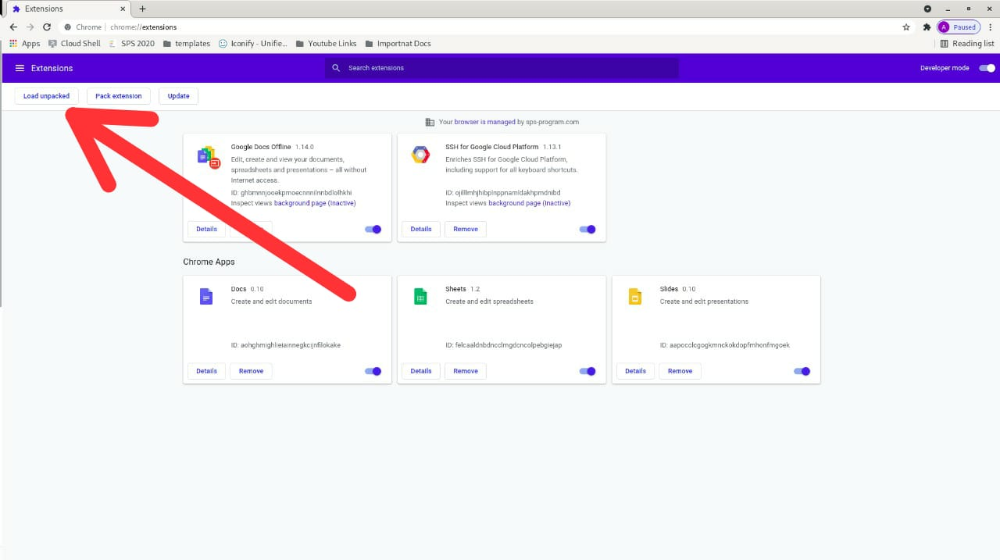
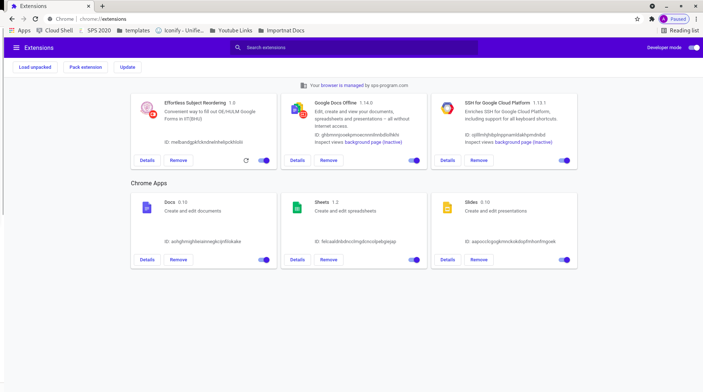
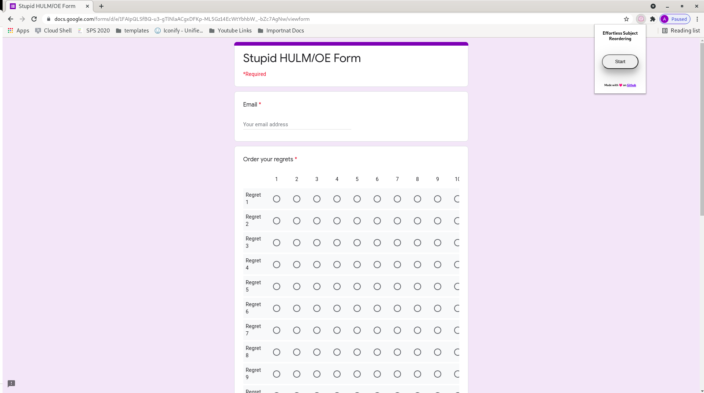
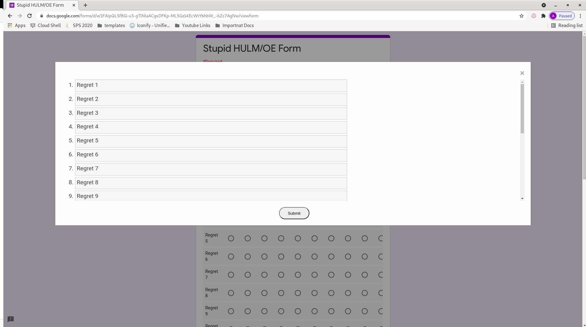
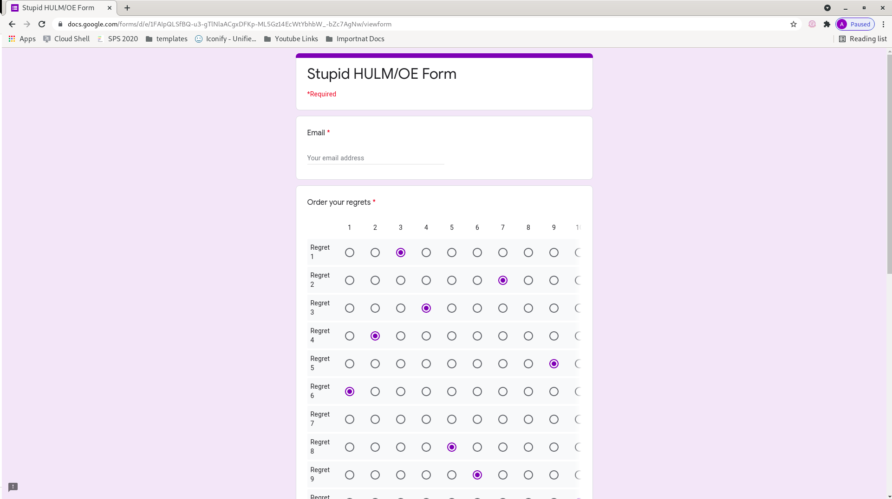

## Description

We have always hated the struggle we had to face while filling the HULM and OE preference form. To end this once and for all, we came with this extension. It enables effortless reordering of the subjects with a simple drag and drop of the mouse.  

## Installation

<iframe width="560" height="315" src="https://www.youtube.com/embed/kdLuHF8pf7U" title="YouTube video player" frameborder="0" allow="accelerometer; autoplay; clipboard-write; encrypted-media; gyroscope; picture-in-picture" allowfullscreen></iframe>

- Download the official zip from [here](https://github.com/TheAnshul756/MCGFTGF/archive/refs/heads/main.zip).
- Unzip the package.
- Open Chrome Extensions Page by clicking the menu icon (three dots) at the top right of Chrome, point to “More Tools,” then click on “Extensions.” or simply type `chrome://extensions/` in the chrome address bar.
  
  
  
- Enable developer mode from the top right corner.
  
  
  
- Click on load unpacked and select the unzipped package.
  
  
  
  Once you see the extension added, now it is ready to use.
  
  
  

## How to use

- Open the HULM/OE Google Form.
- Click on the extension and press start.
  
  

- Simply drag and drop the subjects on the modal that appears to reorder them.
  
  

- Click submit to fill the form.
- The extension will populate the fields. Click submit on the form when you are ready.  

  
  

## Stats

  
## Changelog
v1.0.0:

- Initial release

To report any issues, suggestions or improvement, please do so at [issues](https://github.com/TheAnshul756/MCGFTGF/issues).
